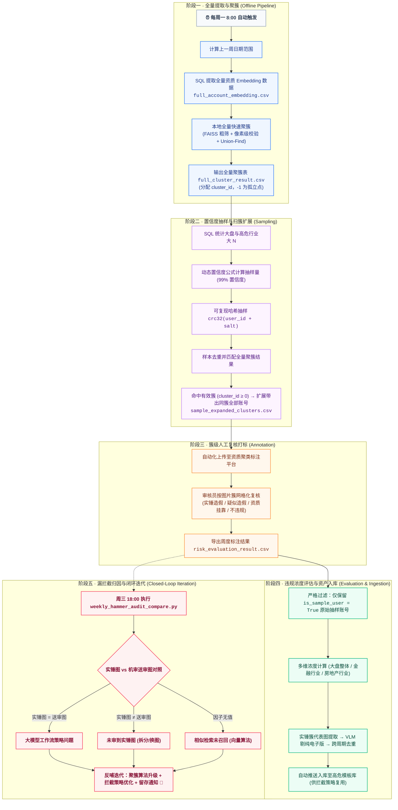
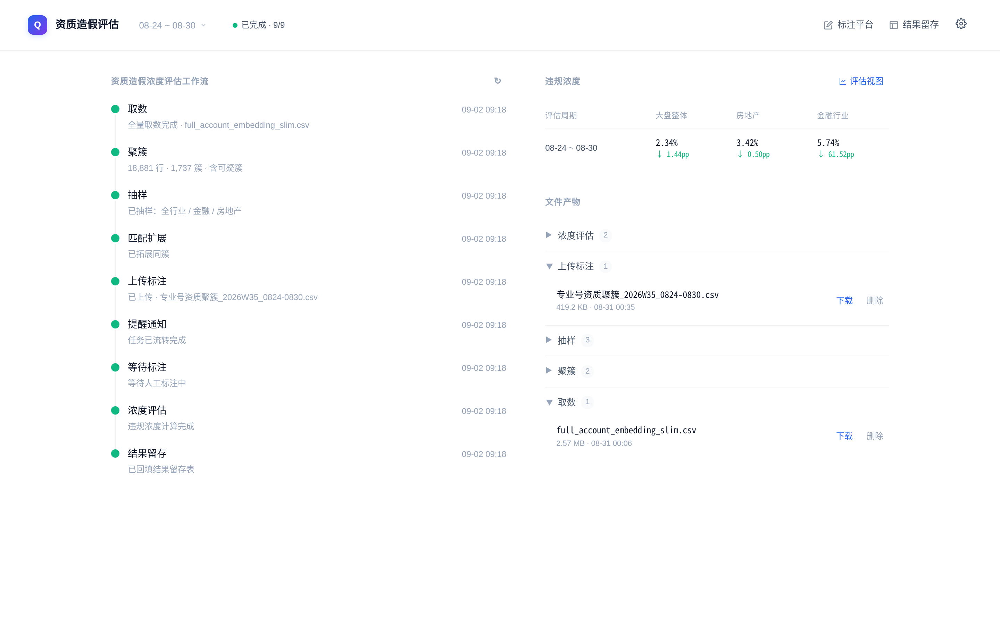
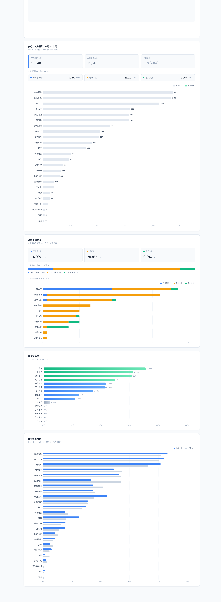
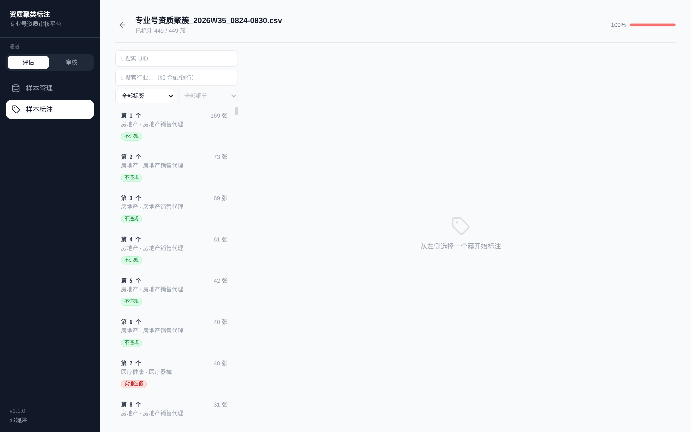
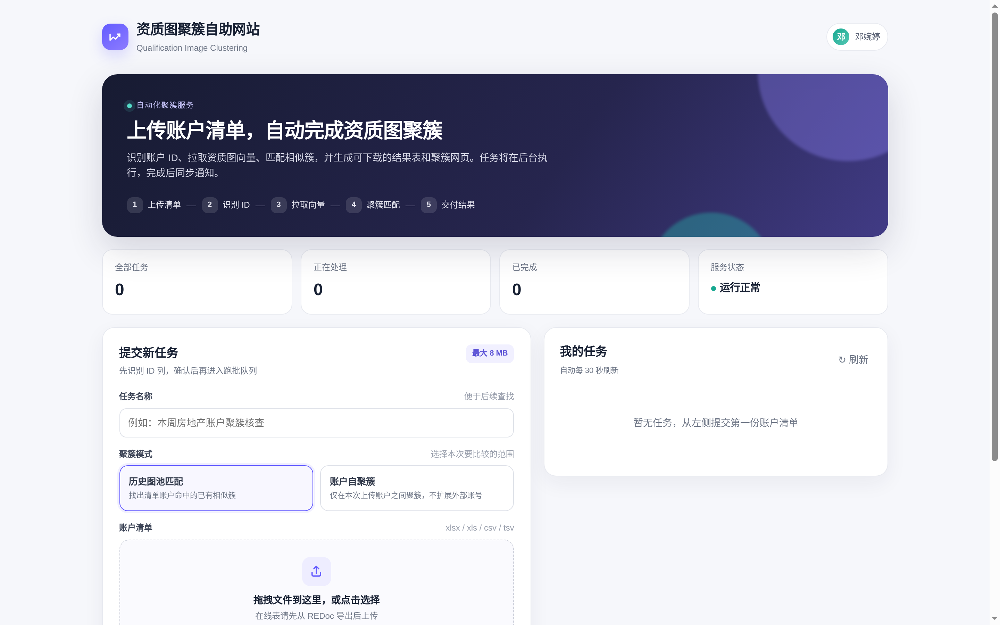

# Pro-Qual-Fraud-Eval

专业号资质造假治理的端到端工程实现，覆盖「相似资质识别 → 聚簇 → 抽样 → 人工复核标注 → 浓度评估 → 高危模板入库 → 漏拦截归因」的周度闭环。

## 背景

平台专业号入驻审核的验真能力主要依赖人工和常规机审，存在商家复用同一套营业执照或协议模板批量注册账号的情况。这类造假以团伙为单位，手法隐蔽且持续对抗升级，人工审核和常规机审都难以有效拦截；原有处置又以单账号为维度，发现一个造假账号无法关联背后的批量团伙，容易出现"打一个、漏一批"的问题。

## 方案

每周固定评估上一周新入驻专业号账号的资质造假风险浓度，了解大盘与高危行业（金融、房地产）的造假水位。具体做法分五侧：

**识别侧**：把资质图片转成 embedding，通过相似图片聚簇识别可能复用同一营业执照或协议模板的账号，再结合像素级相似度校验提升识别准确性。

**抽样侧**：先对全量账户聚簇，再按统计置信度抽样，用抽样账号命中聚簇结果、并扩展同簇账号进入标注池。抽样账号 + 同簇账号一起给标注员看，才能基于完整簇判断是否同版复用。

**复核侧**：聚类结果不直接作为处置依据，而是搭建标注平台和审核标签体系，由审核人员按图片簇逐簇复核，打标为「实锤造假 / 疑似造假 / 资质挂靠 / 不违规」，标注回收后再计算违规浓度。

**入库侧**：复核实锤的簇，挑出簇代表图，经 VLM 剔除纯电子版、跨周期去重后，自动入库到高危模板库，供入驻拦截策略复用，形成"发现 → 拦截"的能力沉淀。

**迭代侧**：每周对实锤造假账号进行「实锤图 vs 机审送审图」对照定位（badcase 归因），分三类——实锤图=送审图（大模型工作流问题）、实锤图≠送审图（图未进机审）、因子无值（算法向量检索问题），据此迭代聚簇算法与拦截策略，形成"发现 → 拦截 → 漏网归因 → 迭代"的闭环。

## 周度工作流

整个评估以周为单位自动运转，5 个核心阶段的完整闭环流程图如下：



### 各环节输入输出

| 环节 | 输入 | 输出 | 说明 |
| --- | --- | --- | --- |
| 全量取数 | 上周日期范围、最新分区 | full_account_embedding.csv | 含 user_id、行业、资质 URL、embeds |
| 全量聚簇 | full_account_embedding.csv | full_cluster_result.csv | 每行追加 cluster_id，-1 表示未成簇 |
| 抽样取数 | 上周日期范围、大 N、抽样量 | overall_sample.csv / finance_sample.csv / realestate_sample.csv | 只需要 user_id 和样本组信息 |
| 样本去重 | 三份抽样表 | dedup_sample_users.csv | 按 user_id 去重，保留样本组 |
| 样本命中簇扩展 | full_cluster_result.csv + 抽样表 | sample_expanded_clusters.csv | 样本账号命中有效簇后，带出同簇所有账号 |
| 标注平台 | sample_expanded_clusters.csv | 标注任务 | 上传给标注员判断 |
| 标注结果 | 标注 CSV | risk_evaluation_result.csv | 计算违规浓度 |
| 高危模板入库 | 实锤簇 + 标注结果 | 校库模板记录 | 代表图 VLM 剔电子版 → 去重 → 入库 |
| 漏拦截归因 | 实锤账号 + 机审因子日志 | 对照 HTML + 汇总 JSON | 实锤图 vs 送审图三类定位，反哺迭代 |

## 识别算法

聚簇分三步完成，输入是"账户 × 资质图 embedding"：

1. **候选边生成**：用 FAISS 对每张图找余弦最近的 top-k 邻居，构成候选边集合。
2. **像素比对建边**：对候选边真正拉取两张图做像素级比对，一致率达到阈值才建立邻接边。
3. **连通成簇**：用 Union-Find 把两两之间的相似关系归并成分组。

推荐使用 `pixel_match` 模式（FAISS 粗筛 + 图片像素匹配精筛）。关键参数：

| 参数 | 作用 | 参考值 |
| --- | --- | --- |
| cosine-topk | 每张图的余弦近邻数 | 5 |
| cosine-prefilter | 余弦相似度预过滤阈值 | 0.98 |
| match-rate-threshold | 像素一致率建边阈值 | 0.95 |
| pixel-tolerance | 像素容差 | 10 |

实际运行中曾遇到"同一模板被拆成多个子簇"的问题——同一模板下的图片变多后，每张图的 top-k 邻居名额被"更相似的其他变体"占满，真正同模板的图进不了候选集，导致像素比对根本没有执行。修复方式：

- 将 top-k 从 5 扩大到 20，缓解邻居饱和；
- 增加**簇间补边**：先用簇内 embedding 均值作为簇代表向量做一轮便宜的簇对余弦粗筛，再在候选簇对里找最相似的成员对做像素比对，超过阈值则把两个簇合并。

## 抽样与浓度评估口径

### 三组样本

每周分别抽三组样本，各自独立计算浓度：

| 样本组 | sample_group | 说明 |
| --- | --- | --- |
| 全行业样本 | 整体样本 | 覆盖所有新入驻专业号 |
| 金融行业样本 | 金融行业样本 | 高危行业专项抽样 |
| 房地产行业样本 | 房地产行业样本 | 高危行业专项抽样 |

### 抽样量计算

抽样量由上一周该样本组的大 N 和违规浓度 P 决定：

- **大 N**：上一周该样本组的新入驻账户数（SQL 计数得到）
- **P**：上周该样本组的违规浓度，首周用兜底值
- **误差范围 e**：P < 10% 时取 2%，P ≥ 10% 时取 5%
- **置信度**：99%（对应 z = 2.576）

样本量公式（含有限总体修正）：

$$n_0 = \frac{Z^2 \cdot p(1-p)}{e^2}, \qquad n = \frac{n_0 \cdot N}{n_0 + N - 1}$$

### 可复现哈希抽样

抽样不是随机数，而是对 `user_id` 拼接盐值后求 crc32 哈希，按哈希值排序取前 n 个。同一盐值每次抽样结果完全一致，保证抽样可复盘、可复现：

```plaintext
rank = row_number() OVER (ORDER BY crc32(concat(user_id, '_seed42')))
```

### 扫簇扩展

抽样 user_id 匹配全量聚簇结果：

- 命中有效簇（cluster_id ≥ 0）→ 带出该簇的同簇其他账号；
- 未成簇（cluster_id = -1）→ 不扩展。

扩展结果 `sample_expanded_clusters.csv` 中区分两类账号：

| 字段 | 含义 |
| --- | --- |
| is_sample_user = True | 原始抽样账号 |
| is_sample_user = False | 同簇扩展账号 |

### 违规浓度计算

标注结果回收后，计算浓度前必须先过滤账号来源：**只保留 is_sample_user = True 的原始抽样账号**。

- 同簇扩展账号只用于辅助标注员判断"这一簇是否同版复用"，**不进入分子也不进入分母**；
- 分子 = 原始抽样账号中被标注为违规的账号数，分母 = 原始抽样账号总数。

```plaintext
全行业违规浓度 = 全行业抽样账号中违规账号数 / 全行业抽样账号数
金融行业违规浓度 = 金融抽样账号中违规账号数 / 金融抽样账号数
房地产违规浓度 = 房地产抽样账号中违规账号数 / 房地产抽样账号数
```

**示例**：抽样账号 A 命中 cluster_1，带出同簇账号 B、C。标注员可参考 A/B/C 判断该簇是否违规，但计算浓度时只统计 A，B/C 不进入分子也不进入分母。

## 审核标签体系

标签分两级。一级标签是复核结论，二级标签进一步区分造假类型：

| 一级标签 | 含义 |
| --- | --- |
| **实锤造假** | 有直接物证、可排除合理解释，例如公章位置/形状完全一致、二维码相同、图片经过 P 图处理 |
| **疑似造假** | 证据指向造假但存在一定合理解释空间，例如电子章批量开具、拍摄背景相似但不完全相同 |
| **资质挂靠** | 多家公司使用同一套资质入驻 |
| **不违规** | 合规的证书电子版等，因模板相同可能被归入同一簇 |

二级标签包括：实锤造假下的"实拍图片 P 图""手机截屏 P 图""公章样式变化""二维码缺失或一致"等；疑似造假下的"资质模糊""批量拍摄"等。

审核操作遵循先整理簇、再打标的流程：若某张图与簇明显无关，先移出或删除，再对整理后的簇打标。

## 系统界面预览

### 1. 评估工作流状态机大盘 (`dashboard`)
展示周度 9 阶段执行流转、实时状态机监控、违规浓度表格与全流程文件产物管理：


### 2. 多维数据分析与归因大盘 (`dashboard/report`)
多周期违规浓度趋势对比、各行业入驻量级分布、造假来源渠道构成与下钻归因：


### 3. 资质聚类人工标注工作台 (`annotation-platform`)
数据集管理、449+ 簇级网格审查、二级分类打标（实锤造假 / 疑似造假 / 资质挂靠 / 不违规）与 100% 进度追踪：


### 4. 聚类跑批自助服务平台 (`cluster-service`)
业务端自助上传账户清单、支持历史图池匹配 / 自聚簇双模式、5 步流水线监控与自动化交付：


## 目录结构

```
pro-qual-fraud-eval/
├── src/                          # 算法管线
│   ├── pipeline/                 # 聚簇 / 抽样 / 扫簇
│   │   ├── cluster_fast.py       # 聚簇主脚本（FAISS + 像素比对 + Union-Find）
│   │   ├── calc_sample_size.py   # 抽样样本量计算
│   │   ├── pick_sampling_error.py# 可复现哈希抽样
│   │   ├── expand_sample_clusters.py  # 抽样命中 → 整簇扩展
│   │   ├── make_annotation_task.py    # 标注任务打包
│   │   └── daily_guard.py        # 日跑数据量护栏
│   ├── dashboard/                # 看板数据推送客户端
│   ├── backfill/                 # 回补 + 周度自检
│   └── utils/                    # 汇总与绘图辅助
├── sql/                          # 取数 SQL 模板
├── scripts/                      # 编排与运维脚本
├── tests/                        # 回归测试
├── dashboard/                    # 评估看板（FastAPI + ECharts）
│   ├── app.py                    # 状态机 + Push API + 数据下钻
│   ├── report_page.html          # 数据大盘
│   └── frontend_v3.html          # 工作流管理面板
├── annotation-platform/          # 标注平台
│   ├── backend/                  # FastAPI + asyncpg + PostgreSQL
│   └── frontend/                 # React 18 + TypeScript + Vite + Tailwind
├── cluster-service/              # 聚类跑批服务
│   ├── app.py                    # 跑批任务管理后端（领任务 / 产物回传）
│   ├── qual_cluster_runner.py    # 跑批执行器（轮询领任务 → 取数 → 聚簇 → 回传）
│   └── frontend/                 # 任务管理页面
├── high-risk-template/           # 高危模板自动入库
│   ├── app.py                    # 人工复核后端（勾选保留/剔除 → 入库）
│   ├── high_risk_media_bot.py    # 入库机器人（代表图选择 → VLM 剔电子版 → 去重 → 入库）
│   ├── AUTOMATION_UPLOAD_API.md  # 自动化上传接口协议
│   └── frontend/                 # 复核页面
├── assets/                       # 系统运行高清截图
│   └── screenshots/              # 运行界面截图（工作流 / 归因大盘 / 标注平台 / 跑批服务）
├── .github/workflows/            # CI（语法检查 + 敏感信息扫描 + 前端构建）
├── docs/                         # 架构与工程文档
├── .env.example                  # 环境变量模板
├── requirements.txt
├── LICENSE                       # MIT License
└── README.md
```

## 快速开始

### 安装依赖

```bash
pip install -r requirements.txt                    # 算法管线
pip install -r dashboard/requirements.txt          # 看板
pip install -r annotation-platform/backend/requirements.txt  # 标注平台后端
pip install -r cluster-service/requirements.txt            # 聚类跑批服务
pip install -r high-risk-template/requirements.txt         # 高危模板入库
cd annotation-platform/frontend && npm install && cd ../..   # 标注平台前端
```

### 运行算法管线

```bash
python src/pipeline/cluster_fast.py \
  --input-file full_account_embedding.csv \
  --method pixel_match \
  --url-col qualification_url \
  --id-col user_id \
  --cosine-topk 5 \
  --cosine-prefilter 0.98 \
  --match-rate-threshold 0.95 \
  --pixel-tolerance 10 \
  --output full_cluster_result.csv \
  --suspect full_suspect_clusters.csv \
  --sample-file overall_sample.csv \
  --sample-file finance_sample.csv \
  --sample-file realestate_sample.csv \
  --sample-id-col user_id \
  --sample-group-col sample_group \
  --sample-expanded-output sample_expanded_clusters.csv
```

### 启动标注平台

```bash
# 后端（Terminal 1）
cd annotation-platform/backend
python init_db.py              # 初始化数据库
uvicorn app:app --port 3001 --reload

# 前端（Terminal 2）
cd annotation-platform/frontend
npm run dev
```

### 启动评估看板

```bash
cd dashboard
uvicorn app:app --port 3000 --reload
```

访问：看板 `http://localhost:3000`，标注平台 `http://localhost:5173`。

## 环境变量

参考 [`.env.example`](.env.example)：

| 变量 | 说明 |
| --- | --- |
| `DASH_PUSH_TOKEN` | 看板 Push API 鉴权 Token |
| `ANNOTATION_PLATFORM_URL` | 标注平台访问地址 |
| `RESULT_STORE_URL` | 标注结果落地表格地址 |
| `WORKFLOW_PUSH_TOKEN` | 工作流状态推送 Token |
| `DB_HOST` / `DB_PORT` / `DB_USER` / `DB_PASSWORD` / `DB_NAME` | PostgreSQL 连接信息 |
| `ENABLE_DEV_AUTH` | 本地开发时绕过 SSO（生产必须关闭） |
| `SSO_COOKIE_FILE` | 内部接口 SSO cookie 文件路径（高危模板入库机器人使用） |
| `MITM_CA_PATH` | 自签证书 CA 路径（内网接口 TLS 校验） |
| `HRM_AUTOMATION_UPLOAD_TOKEN` | 高危模板入库自动化上传鉴权 Token |
| `WORKFLOW_RUNNER_TOKEN` | 聚类跑批执行器鉴权 Token |

未配置数据库时，看板会自动降级为只读演示模式，方便本地体验。

## 相关文档

- [`docs/ARCHITECTURE.md`](docs/ARCHITECTURE.md)：架构与设计决策
- [`docs/BADCASE_ITERATION.md`](docs/BADCASE_ITERATION.md)：漏拦截原因定位与算法/策略迭代（badcase 归因）
- [`docs/PACKAGING.md`](docs/PACKAGING.md)：从内网脚本脱敏为公开仓库的过程记录
- [`dashboard/README.md`](dashboard/README.md)：评估看板说明
- [`annotation-platform/README.md`](annotation-platform/README.md)：标注平台说明
- [`cluster-service/README.md`](cluster-service/README.md)：聚类跑批服务说明
- [`high-risk-template/AUTOMATION_UPLOAD_API.md`](high-risk-template/AUTOMATION_UPLOAD_API.md)：高危模板入库自动化上传接口

## 许可证

本项目遵循 [MIT License](LICENSE)。仓库为内网系统脱敏后的开源版本，核心算法、系统架构与工程实现均完整保留。